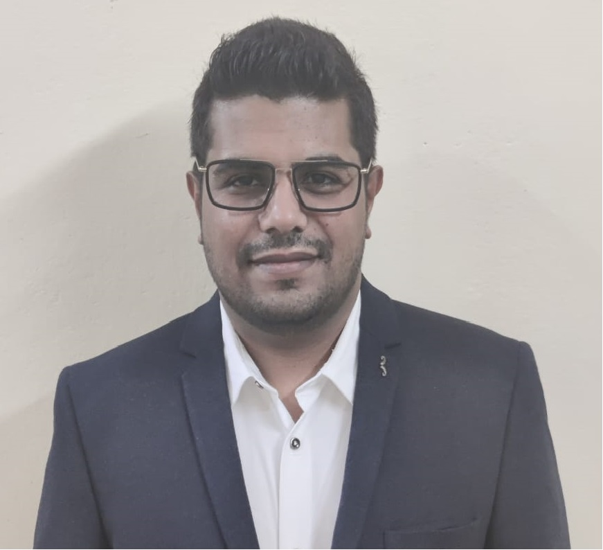
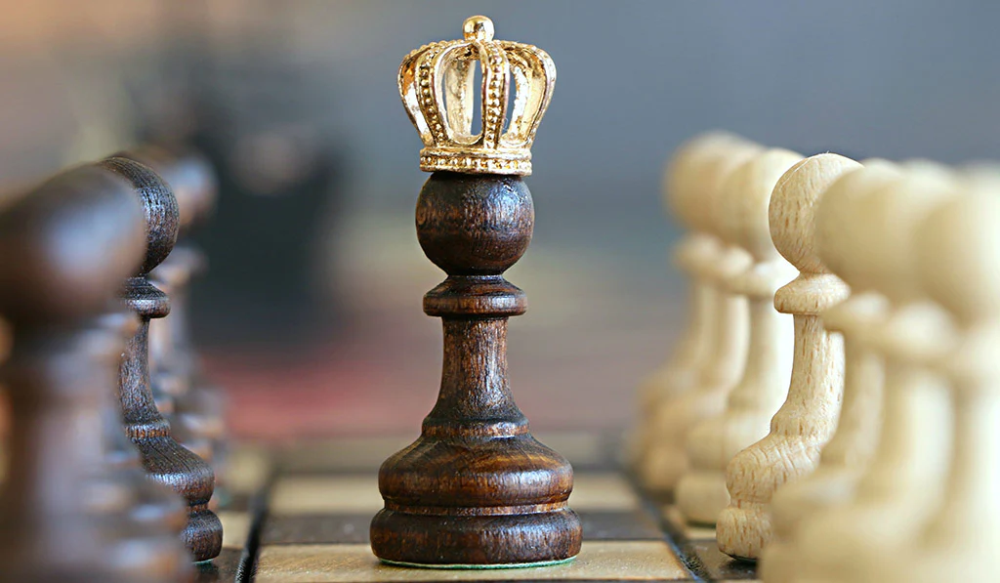

# Abhishek Panjwani

## I am a Strategist.

## Where are you from?

I am from Indore, Madhya Pradesh-India.

## My first Computing Device
It was a Desktop computer, with [Windows 2000 ME] (https://www.google.com/url?sa=t&rct=j&q=&esrc=s&source=web&cd=&cad=rja&uact=8&ved=2ahUKEwiN_I23qZWBAxVRm4kEHaYmDT8QFnoECCcQAQ&url=https%3A%2F%2Fen.wikipedia.org%2Fwiki%2FWindows_Me&usg=AOvVaw2T1qKLbbPHq8db7QInOmt8&opi=89978449) "Wikipedia article for Windows 2000 ME" installed in in it.

## Interests
I love to listen to the music, play musical instruments and Play sports such as Cricket, Chess and Table Tennis.

## Interesting about me.
I have around 8 years of work experience as a Support Engineer. I have done mutiple certifications such as Hardware & Networking, MCP, CCNA, MCSE, MCP in Azure Administrator and Dell Certification.
